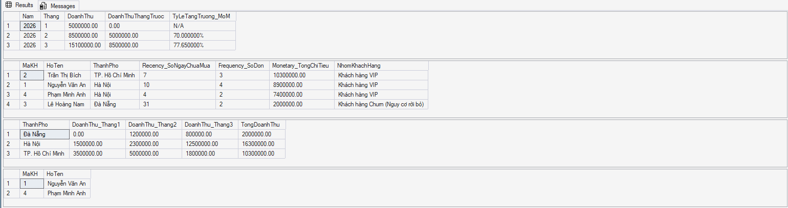

# 📊 E-Commerce SQL Data Analysis & Query Optimization



## 📌 Executive Summary
Project này tập trung vào việc xử lý, phân tích dữ liệu bán hàng Thương mại điện tử và tối ưu hóa hiệu năng truy vấn trên hệ quản trị cơ sở dữ liệu **SQL Server**. 

Dự án cung cấp các báo cáo phân tích kinh doanh quan trọng (doanh thu MoM, phân hạng khách hàng RFM, báo cáo PIVOT) đồng thời chứng minh giải pháp tối ưu tốc độ truy vấn thông qua việc đánh giá **Execution Plan** và tạo **Non-Clustered Index**.

---

## 🛠️ Tech Stack & Key Concepts
- **Database Management System:** Microsoft SQL Server / SQL Server Management Studio (SSMS v22)
- **SQL Techniques Applied:**
  - **Data Modeling & DDL/DML:** Quản lý khóa chính, khóa ngoại (`FOREIGN KEY`), ràng buộc dữ liệu.
  - **Advanced Analytics:** Common Table Expressions (`CTE`), Window Functions (`LAG`, `OVER`).
  - **Customer Segmentation:** Mô hình hóa **RFM (Recency, Frequency, Monetary)** bằng `CASE WHEN`.
  - **Data Transformation:** Kỹ thuật `PIVOT` biến đổi dòng thành cột báo cáo theo chuỗi thời gian.
  - **Performance Optimization:** Đánh giá Kế hoạch thực thi (`Execution Plan`), thiết kế chỉ mục `NONCLUSTERED INDEX` chứa cột phủ (`INCLUDE`).

---

## 📁 Repository Structure
```text
├── ThuongMaiDienTu.sql            # Script khởi tạo Database, Bảng & Dữ liệu mẫu
├── Data_Analyst_SQL_Project.sql   # Script tổng hợp các truy vấn phân tích & tối ưu Index
├── query_results.png              # Hình ảnh minh họa kết quả truy vấn báo cáo
└── README.md                      # Tài liệu hướng dẫn & giải thích dự án
